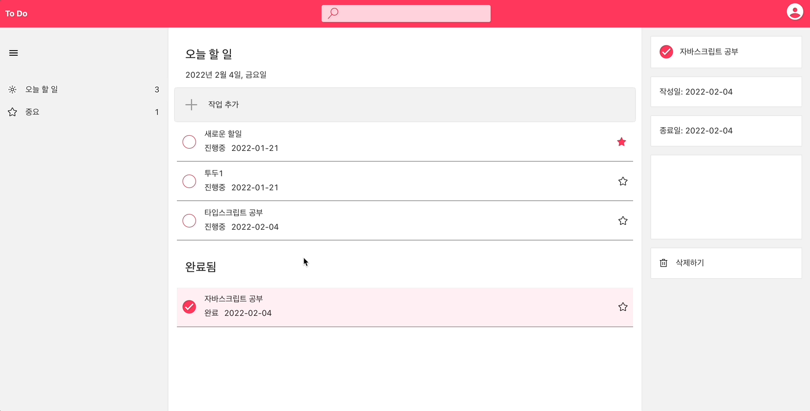
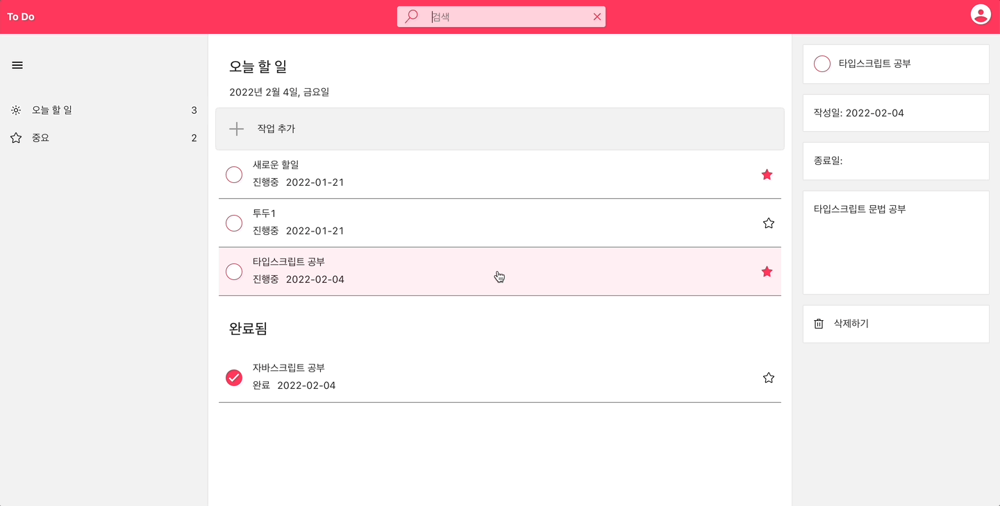
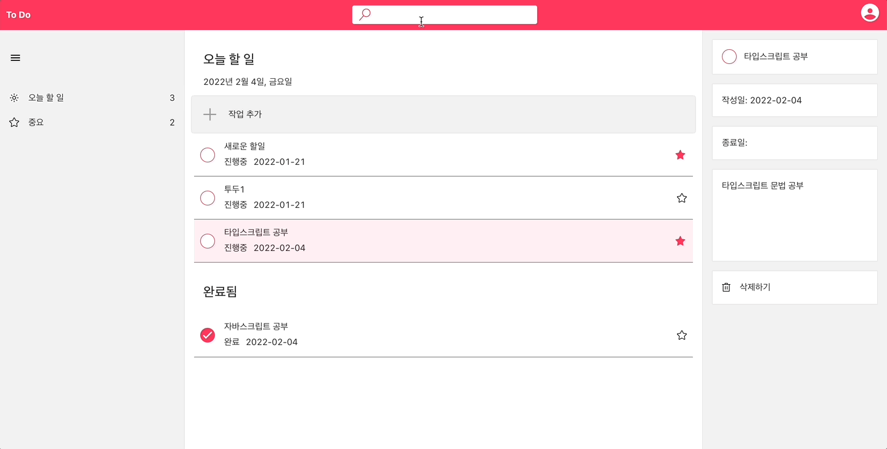

# Tripbtoz Todo Project

트립비토즈 과제 - Todo 서비스 프로젝트

## 🗂 목차

- [**프로젝트 소개**](#1)
- [**기술 스택**](#2)
- [**주요 기능**](#3)
- [**웹서비스 소개**](#4)
- [**개발 기간**](#5)
- [**실행 방법**](#6)
- [**참고 사이트 및 기타 정보**](#7)

<div id='1'></div>
<br />

### 💁‍♂️ 프로젝트 소개

- 트립비토즈 프론트엔드 과제 : To Do 서비스 프로젝트
- UI 및 구성은 Microsoft To Do를 참조하여 제작하였습니다.

<div id='2'></div>
<br />

### 🛠 기술 스택

- react, redux, redux-saga, styled-components, typescript
- node, express, mongoose

<div id='3'></div>
<br />

### 💡 주요 기능

- 할 일 타이틀을 입력하여 할 일 등록. 등록시 자동으로 등록일 입력
- 각 할 일의 완료 여부, 타이틀 및 세부 내용을 수정
- 할 일 삭제
- 할 일을 타이틀로 검색
- 중요한 할 일만 따로 보기

<div id='4'></div>
<br />

### ⭐️ 웹서비스 소개

|                    To Do 등록                     |
| :-----------------------------------------------: |
|  |

|                  To Do 진행중/완료                  |
| :-------------------------------------------------: |
|  |

|                    To Do 수정                     |
| :-----------------------------------------------: |
|  |

|                    To Do 삭제                     |
| :-----------------------------------------------: |
|  |

|                    To Do 검색                     |
| :-----------------------------------------------: |
|  |

|                   To Do 중요한 일                    |
| :--------------------------------------------------: |
|  |

<div id='5'></div>
<br />

### 🗓 개발 기간

`2022.01.03(월) ~ 2022.01.21(금)`

<div id='6'></div>
<br />

### 🖥 실행 방법

- 로컬에 mongodb가 실행되고 있어야 원활하게 서비스 이용이 가능합니다.

1. 저장소 복제
2. frontend 이동 후 설치

```bash
$ cd frontend
$ yarn install
$ yarn start
```

3. 새로운 터미널 열기
4. backend 이동 후 설치

```bash
$ cd backend
$ yarn install
$ nodemon src
```

<div id='7'></div>
<br />

### 📌 참고 사이트 및 기타 정보

1. 참고 사이트

- [Microsoft To Do UI](https://to-do.live.com/tasks/today)
- [몽고db연결](https://poiemaweb.com/mongoose)
- [Swagger 연동](https://any-ting.tistory.com/105)
- [파일시스템 사용](https://smilehugo.tistory.com/entry/nodejs-json-create-store-read-update)

2. 기타정보

- Git Convention
  - Feat: 새로운 기능을 추가할 경우
  - Fix: 버그를 고친 경우
  - Design: CSS 등 사용자 UI 디자인 변경
  - Style: 코드 포맷 변경, 세미 콜론 누락, 코드 수정이 없는 경우
  - Comment: 필요한 주석 추가 및 변경
  - Docs: 문서를 수정한 경우
  - Test: 테스트 추가, 테스트 리팩토링(프로덕션 코드 변경 X)
  - Chore: 빌드 테스트 업데이트, 패키지 매니저를 설정하는 경우(프로덕션 코드 변경 X)
  - Rename: 파일 혹은 폴더명을 수정하거나 옮기는 작업만인 경우
  - Remove: 파일을 삭제하는 작업만 수행한 경우
